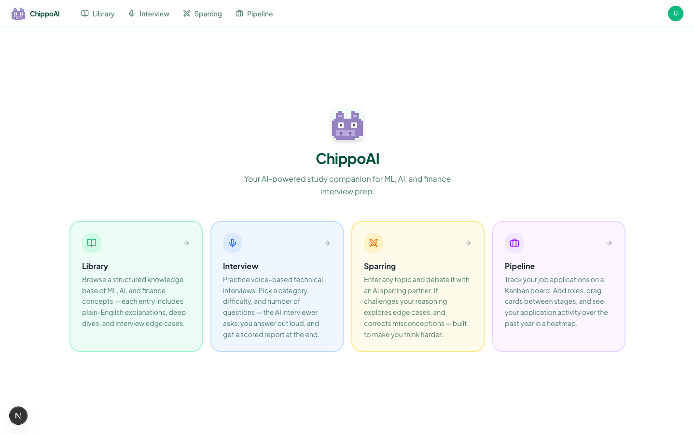
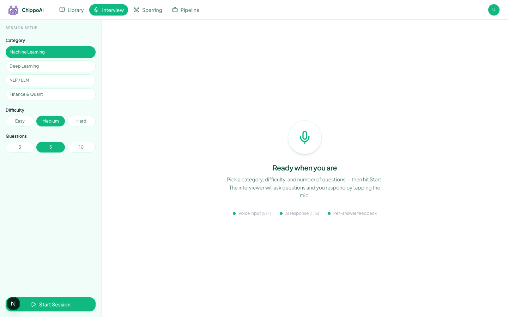
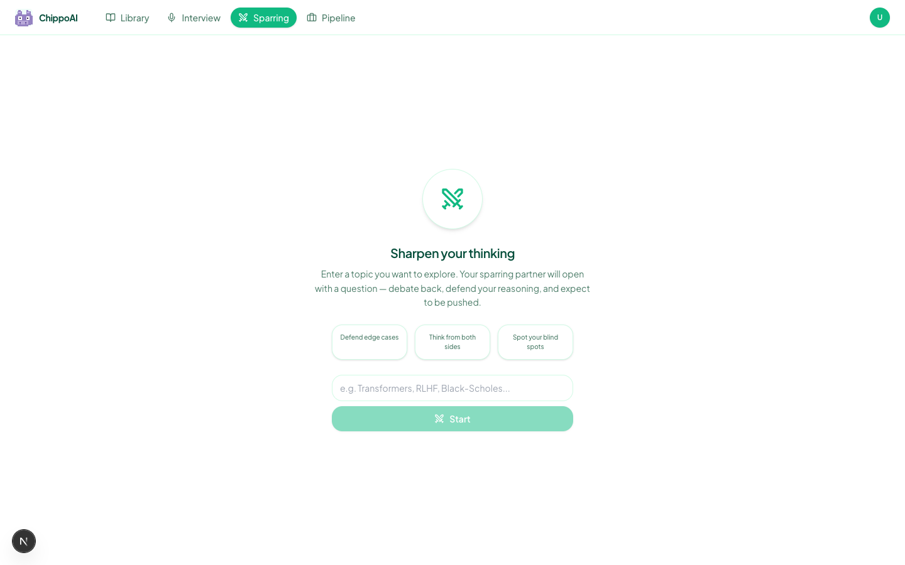
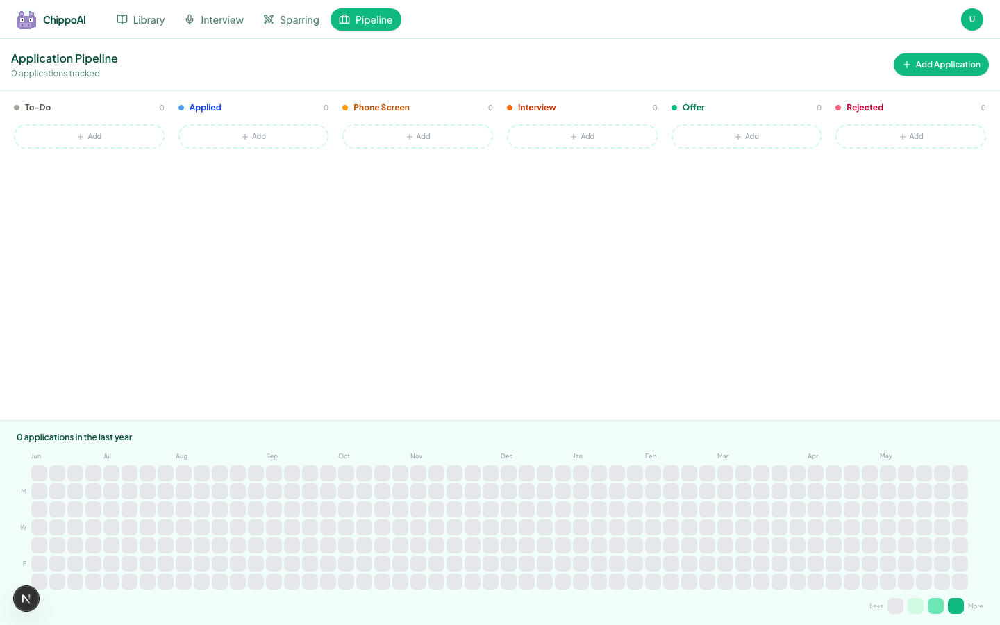
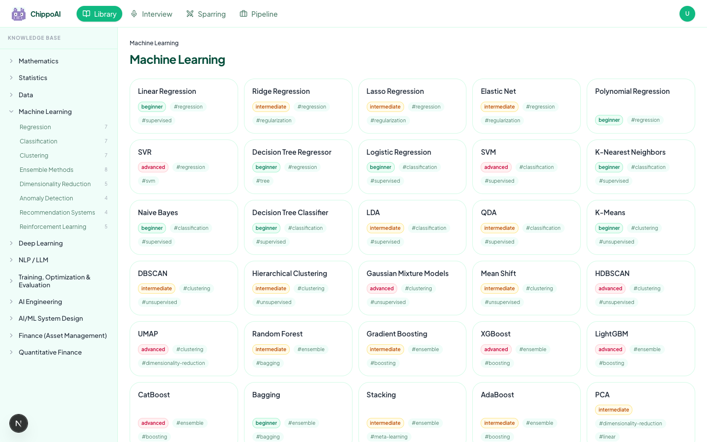

# ChippoAI

An AI-powered study companion for ML/AI and Finance interview prep. Runs fully locally — just bring your own (free) OpenRouter API key.

---

## Screenshots

### Home


### Interview


### Sparring


### Pipeline


### Library


---

## Features

| Feature | What it does |
|---|---|
| **Library** | Structured knowledge base of ML, AI, and finance concepts |
| **Interview** | Voice-based mock interviews — pick category, difficulty, and question count. Get a scored report at the end |
| **Sparring** | Debate any topic with an AI partner that challenges your reasoning and corrects misconceptions |
| **Pipeline** | Kanban board to track job applications, with a yearly activity heatmap |
| **WhatsApp Digest** | Daily AI-generated study digest delivered to your WhatsApp (optional, requires Twilio) |

---

## Prerequisites

Before you start, make sure you have:

- **Python 3.11+** — [download](https://www.python.org/downloads/)
- **Node.js 18+** — [download](https://nodejs.org/)
- **A free OpenRouter API key** — [sign up at openrouter.ai](https://openrouter.ai) → go to Keys → Create Key. No credit card needed.

---

## Setup

### 1. Clone the repo

```bash
git clone https://github.com/DSpeanut/FinAI_interviewpilot.git
cd FinAI_interviewpilot
```

---

### 2. Set up the API (backend)

```bash
cd apps/api
```

**Create a Python virtual environment:**
```bash
python -m venv .venv
```

**Activate it:**
```bash
# Mac / Linux
source .venv/bin/activate

# Windows
.venv\Scripts\activate
```

**Install dependencies:**
```bash
pip install -r requirements.txt
```

**Create your environment file:**
```bash
cp .env.example .env
```

Open `apps/api/.env` in any text editor and replace the placeholder with your OpenRouter API key:
```
OPENROUTER_API_KEY=sk-or-v1-your-key-here
```
Leave everything else as-is.

---

### 3. Set up the web app (frontend)

Open a **new terminal** and run:

```bash
cd apps/web
npm install
cp .env.local.example .env.local
```

No changes needed in `.env.local` for local development.

---

## Running

You need **two terminals running at the same time**.

**Terminal 1 — start the API server:**
```bash
cd apps/api
source .venv/bin/activate    # Windows: .venv\Scripts\activate
uvicorn app.main:app --port 8000
```

You should see:
```
INFO: Uvicorn running on http://127.0.0.1:8000
```

**Terminal 2 — start the web app:**
```bash
cd apps/web
npm run dev
```

You should see:
```
✓ Ready in ...ms
- Local: http://localhost:3000
```

Open **[http://localhost:3000](http://localhost:3000)** in your browser.

---

## Feature Guide

### 🎤 Interview
Practice technical interviews with an AI interviewer.

1. Go to **Interview** in the nav
2. Pick a **category** (ML, Deep Learning, NLP/LLM, Finance & Quant)
3. Pick a **difficulty** (Easy / Medium / Hard)
4. Pick the **number of questions** (3, 5, or 10)
5. Click **Start Session** — the AI generates your questions upfront
6. When the mic button is green, **tap it** and speak your answer
7. The mic turns red while recording — it auto-submits when you stop speaking
8. After all questions, a **scored report** is generated with per-question feedback and an overall summary

> Voice requires **Chrome or Edge** — Safari and Firefox do not support the Web Speech API.

---

### ⚔️ Sparring
Debate any topic with an AI that pushes back on your thinking.

1. Go to **Sparring** in the nav
2. Type a topic (e.g. "Transformers", "Black-Scholes", "RLHF")
3. Click **Start** — the AI opens with a question or challenge
4. Respond in the text box and press Enter
5. The AI debates, explores edge cases, and corrects you if needed

---

### 📋 Pipeline
Track your job applications on a Kanban board.

1. Go to **Pipeline** in the nav
2. Click **Add Application** — enter company, role, URL, and applied date
3. **Drag cards** between columns to update your status
4. **Click a card** to edit details or delete it
5. The heatmap at the bottom shows your application activity over the past year

> Data is saved in your browser's `localStorage` — it persists between sessions on the same browser but won't sync across devices.

---

### 📚 Library
Browse the knowledge base of ML/AI and finance concepts. Each entry includes a plain-English explanation, deep dive, and interview edge cases.

---

### 📱 WhatsApp Morning Digest (optional)

Get a daily AI-generated study digest delivered to your WhatsApp — two topics every morning and evening, automatically.

This runs as a **GitHub Actions workflow** (no local server needed), so your machine doesn't have to be on.

**What you need:**
- A [Twilio](https://www.twilio.com) account (free trial available)
- Twilio WhatsApp Sandbox set up ([guide here](https://www.twilio.com/docs/whatsapp/sandbox))
- Your OpenRouter API key (same one used for the app)

**Setup:**

1. Go to your GitHub repo → **Settings → Secrets and variables → Actions**
2. Add the following secrets:

| Secret name | Where to find it |
|---|---|
| `OPENROUTER_API_KEY` | [openrouter.ai](https://openrouter.ai) → Keys |
| `TWILIO_ACCOUNT_SID` | Twilio Console → Account Info |
| `TWILIO_AUTH_TOKEN` | Twilio Console → Account Info |
| `TWILIO_WHATSAPP_FROM` | `whatsapp:+14155238886` (Twilio sandbox number) |
| `TWILIO_WHATSAPP_TO` | `whatsapp:+your_number` (your WhatsApp number) |

3. The workflow runs automatically at **8am and 6pm (BST/GMT)** via GitHub Actions. You can also trigger it manually from the **Actions** tab → **Morning Digest** → **Run workflow**.

> The digest picks topics from the Library knowledge base, generates a 2-bullet summary per topic using AI, and sends it to your WhatsApp. It tracks what's been sent so you don't get repeats.

---

## Troubleshooting

**API not starting?**
- Make sure your virtual environment is activated (`source .venv/bin/activate`)
- Check that `apps/api/.env` exists and has your API key

**"Rate limited" errors?**
- Free models on OpenRouter have shared rate limits — wait a few seconds and retry
- You can switch models by changing `MODEL_NAME` in `apps/api/.env` to any free model at [openrouter.ai/models](https://openrouter.ai/models?q=free)

**Voice not working in Interview?**
- Use Chrome or Edge (not Safari or Firefox)
- Make sure your browser has microphone permission for `localhost`

**Web app can't reach the API?**
- Confirm the API server is running on port 8000
- Check that `apps/web/.env.local` contains `NEXT_PUBLIC_API_URL=http://localhost:8000`

**WhatsApp digest not sending?**
- Check your GitHub Actions secrets are all set correctly
- Make sure your phone number is joined to the Twilio WhatsApp Sandbox (send "join [your-sandbox-word]" to the Twilio number first)
